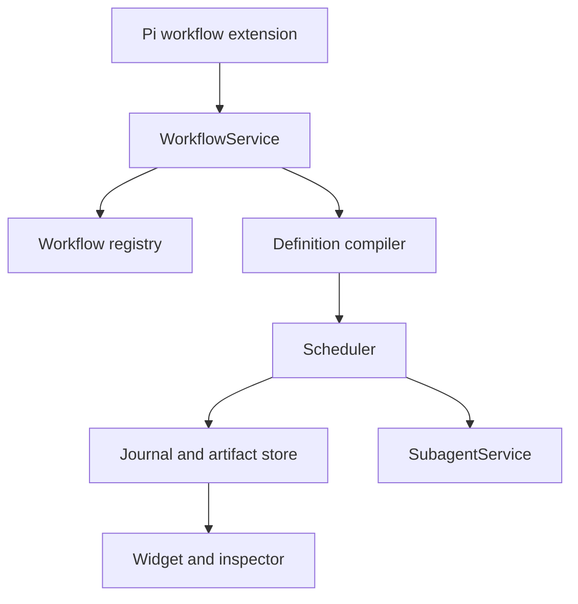

# Architecture

## Boundary

`pi-workflow` owns orchestration and durable workflow state. Physical agent
execution belongs exclusively to `pi-subagent`.

## Layers

1. **Extension adapter** registers workflow tools, commands, and UI.
2. **Registry** discovers definitions using Pi's effective agent directory.
3. **Definition runtime** exposes the trusted TypeScript authoring API.
4. **Compiler** binds source, input, policy, and resource identities.
5. **Scheduler** owns task readiness, concurrency, cancellation, and finalizers.
6. **Effect interpreter** materializes stable-keyed operations while the trusted workflow function runs.
7. **Executors** dispatch agent tasks or deterministic support tasks.
8. **Store** owns events, snapshots, artifacts, leases, and replay records.
9. **UI** is a projection of persisted state, never the state owner.

## Definition roots

Name resolution is deterministic and provenance-aware:

1. `<cwd>/workflows/`
2. `<cwd>/.pi/workflows/`
3. `<getAgentDir()>/workflows/`
4. roots registered by trusted Pi packages
5. built-in workflows

Project roots require Pi project trust. Package roots register through a typed
service API; paths are not hardcoded in the workflow engine.

## Static workflows

Saved workflows are trusted TypeScript modules default-exporting one
`defineWorkflow({ meta, run })` object. They receive a bounded
`WorkflowContext`; internal services, stores, and Pi extension objects are not
exposed.

Durable resume re-executes `run` from its entry point. Stable-keyed context
operations are effects resolved from the journal or executed live. JavaScript
continuations are never serialized.

## Dynamic workflows

Dynamic workflow support is a later layer over the same host operations. A
worker-thread VM supplies determinism and a narrow RPC surface. It is not an OS
security boundary. Every host operation performs normal authority checks.

## Subagent integration

The workflow extension obtains one compatible `SubagentService` capability at
startup. Absence or incompatibility fails before a workflow starts. It never
loads or instantiates another subagent implementation.
