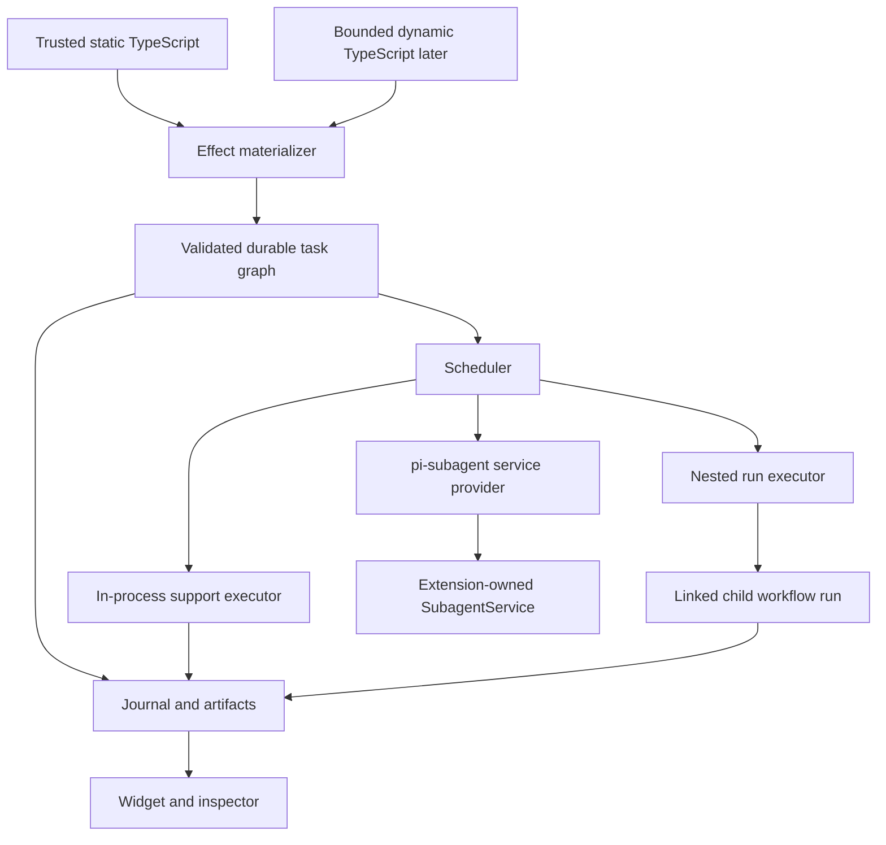

# Architecture

## Boundary

`pi-workflow` owns authoring interpretation, orchestration, and durable workflow
state. Physical agent execution belongs exclusively to `pi-subagent`.

Publication, push, pull requests, merge, release, and deployment are outside
this runtime.

## Layers

1. **Extension adapter** registers the current list, validate, run, status,
   wait, stop, and reconcile tools plus compact status commands and session
   shutdown draining.
2. **Registry** discovers definitions using Pi's effective agent directory and
   project trust.
3. **Authoring frontend** exposes typed task and artifact handles to trusted
   static TypeScript.
4. **Effect materializer** validates stable-keyed declarations and commits
   declarative task records.
5. **Scheduler** owns readiness, bounded concurrency, cancellation, budgets,
   and finalization.
6. **Executors**: the task launcher and task finalizer dispatch agent tasks
   through the shared service; the support task executor runs registered
   deterministic implementations in the host process; the nested run executor
   launches, waits for, and imports from a linked child workflow run through
   the service's nested run provider. There is no other executor.
7. **Store** owns events, snapshots, artifacts, leases, fencing, and replay
   records.
8. **UI** projects persisted state and never owns lifecycle authority.

## Definition roots

Name resolution is deterministic and provenance-aware:

1. `<cwd>/workflows/`
2. `<cwd>/.pi/workflows/`
3. `<getAgentDir()>/workflows/`
4. roots registered by trusted Pi packages
5. built-in workflows

Project roots require Pi project trust. Package roots register through a typed
workflow API; consumer paths are not hardcoded in the engine.

## Static workflows

Saved workflows are trusted TypeScript modules default-exporting one
`defineWorkflow` object. Input and output schemas are mandatory. The module
receives a bounded `WorkflowContext`; stores, scheduler internals, Pi extension
objects, credentials, and `SubagentService` are not exposed.

Effect calls return non-thenable task and artifact handles. The effect
materializer lowers each declaration into a validated `TaskSpec`. An explicit
`ctx.result` barrier waits for concrete data when orchestration control flow
requires it.

A workflow can therefore produce:

- a complete DAG when it declares handle dependencies before requesting values;
- an incrementally discovered DAG when later declarations depend on concrete
  earlier results.

The scheduler operates on the same declarative records in both cases.

## Durable execution

A run is durable from its first executable task. Before any child launch the
runtime has persisted:

- definition and input identity;
- workflow run creation;
- scheduler lease and fencing generation;
- materialized task declaration;
- task-execution generation;
- exact subagent preflight identity;
- launch intent and deterministic operation ID.

The scheduler derives readiness and failed-dependency blocking from committed
journal state and admits independent tasks up to the immutable effective run
concurrency. Selection and journal mutation remain serialized in materialization
order; child waits occur outside that queue and may complete in any order. A
process-local claim prevents one scheduler instance from waiting on the same
child twice. Restart discards those claims and reconstructs active children from
durable launch receipts. Stop intent remains durable before child interruption
and drains multiple active children through the same settlement and finalization
path. It does not treat an in-memory wait promise as authority. Artifact import and child release are required later phases of the same
execution lifecycle, so child settlement alone cannot complete a task. The
workflow store imports schema-validated structured output as canonical JSON,
binds its provenance into artifact identity, persists import evidence, and then
persists release intent before invoking the owner client. Only a durable release
receipt permits terminal execution and task evidence. A downstream agent task
resolves only its explicitly named input handles. The launcher reads those
workflow-owned blobs through the fenced artifact store, revalidates provenance,
digest, canonical encoding, and producer schema, and embeds bounded untrusted
JSON envelopes into the concrete delegated context before subagent preflight.
Artifact paths and unrelated predecessor outputs are never exposed.

Resume reconstructs state from the append-only journal and re-executes the
workflow function from its entry point. Matching task, result, phase, and log
effects replay or reconcile. Concrete result effects are loaded only from
schema- and digest-verified workflow-owned artifacts. The final return value is
validated and committed as a separate workflow output artifact before run
completion. JavaScript continuations are never serialized.

## Support execution

Support tasks are deterministic trusted code declared through the same effect
frontend as agent tasks. `ctx.support(key, descriptor)` is the only authoring
surface: the descriptor is produced by a typed helper from `defineSupportTask`
in a trusted package. There is no string-addressed API and no inline callback;
a workflow module may import only registered module specifiers, and the future
dynamic frontend lowers into the same `SupportTaskSpec` record.

Implementations enter the runtime only through the constructor registry passed
to `createWorkflowService({ supportTasks })`. That registry is frozen when the
service is created, never persisted, and resolved again on every restart by
exact canonical identity. The support task executor runs the resolved
implementation in the host process: no subagent, VM, worktree, model, or web
request is involved, and the implementation is not sandboxed.

Before the implementation runs, the runtime has persisted the support execution
record and durable support intent (implementation, parameter, and input
digests). The output is validated, written to the workflow artifact store as a
canonical JSON result artifact, declared, committed, and terminalized before the
task becomes `completed`. A `running` support task occupies one concurrency
lane; it reserves no cost, tokens, or child runtime, and the recorded
`durationMs` is diagnostic only. Stop aborts the scheduler stop signal, which
the implementation receives as `signal`; the executor terminalizes the task as
cancelled and discards a late result.

## Nested workflows

A nested workflow task (`kind: "workflow"`) is declared through
`ctx.workflow(key, { workflow, input })` in the same effect frontend as agent
and support tasks. The child definition is referenced by name and resolved from
the same discovery pass and trust gate as the parent; nothing is loaded from a
run directory or a dynamic import. At declaration the runtime captures the
child's definition identity, source digest, version, input and output schemas,
declared budget, timeout, and concurrency, validates the concrete `input`
against the child's input schema, and binds all of it into the task identity.
Child source drift therefore fails replay of the parent. Artifact inputs into
a child are not supported in this revision: `input` is a concrete JSON value,
while the nested result artifact is parent-owned and may be consumed by later
parent tasks as an ordinary input.

Execution is a **linked child run**. The parent scheduler routes the task by
kind to the nested run executor, which persists the workflow-kind execution
record with a deterministic `childRunId`, durable launch intent (budget,
timeout, deadline, concurrency), and then asks the service to create a separate
run: its own journal, lease, artifact store, subagent owner binding
`pi-workflow:<childRunId>`, and immutable run record carrying `depth` and
`parent { runId, taskId, executionId, ancestorDefinitionIdentities }`. The
child composes the same launcher, finalizer, support executor, scheduler, and
static runtime as a root run and re-executes its own trusted source from entry;
there is no second scheduler class and no persisted continuation. Depth is
bounded at 0 through 3, a run may declare at most 64 workflow tasks, and a
definition already on the ancestor chain is rejected as recursion.

The parent reserves the child's declared budget while the child runs and
settles with the child's summed usage; the child's effective budget and
deadline are capped by the parent's reservation and deadline. When the child
completes, the parent reads the child's declared output artifact with full
verification, validates it against the captured output schema, and copies it
as verified bytes into the parent store before the parent task completes.
Cross-run artifact references remain impossible otherwise. Parent stop and
deadline stop the child through the parent task and wait for its terminal
state; a child run is also independently addressable by its own run ID.

## Subagent integration

The `pi-subagent` extension registers one lazy provider on Pi's process-local
event bus. `pi-workflow` acquires that provider through
`@vegardx/pi-subagent/service-provider`, validates the exact runtime contract,
and obtains the same service instance used by the standalone subagent tool.

Workflow never:

- constructs a second `SubagentService`;
- starts Gondolin or a Pi child session directly;
- accesses subagent stores behind the service;
- shuts down the provider or service;
- treats a run ID as bearer authorization.

Each workflow run obtains an owner-bound client. The workflow adapter reacquires
the provider before each owner binding, pins the first service object for the
lifetime of that extension runtime, and rejects provider removal or service
replacement. It returns only the owner client, never the service or its shutdown
method. Missing, duplicate, malformed, or incompatible providers fail before
workflow work starts.

## Workflow service

The session-scoped service discovers definitions under current trust, validates
input before creating a run, and acquires the exact shared subagent owner client
before durable workflow state exists. An immutable private run record binds the
project root, definition name/path/source/identity, input, creation time,
depth, and (for a linked child run) parent lineage for restart reconstruction.

Each owned run composes one fenced journal, workflow artifact store, launcher,
finalizer, support task executor bound to the frozen constructor registry,
nested run executor bound to the service's nested run provider, sequential
scheduler, and static source runtime. Root runs are created at depth 0; the
provider creates child runs at the parent's depth plus one under the same
service, and every owned run is a peer in the same run directory. Completed
runs keep their workflow lease until session shutdown so concurrent status,
wait, stop, and terminal projection cannot race lease release. A replacement
session can reacquire the lease and reconstruct nonterminal work from the run
record and journal. Status and output are always journal/artifact projections,
and every view reports `depth` and, for a child, `parent`; in-memory promises
are only wait notifications. Session shutdown stops owned runs in ascending
depth order, so children are cancelled through their parents before their own
leases are released.

## Dynamic workflows

Dynamic workflows are a later authoring frontend over the same materializer.
Their code runs in a bounded worker-thread VM and calls host operations through
RPC. The host validates every requested task before committing it to the graph.

Dynamic code receives no direct filesystem, environment, process, credential,
network, module, store, extension, scheduler, or subagent object. The VM is a
determinism and API boundary, not an OS security boundary.

Recovery persists the approved source and digest, starts a fresh VM, re-executes
from entry, and replays matching effects through the same interpreter used for
static workflows.
