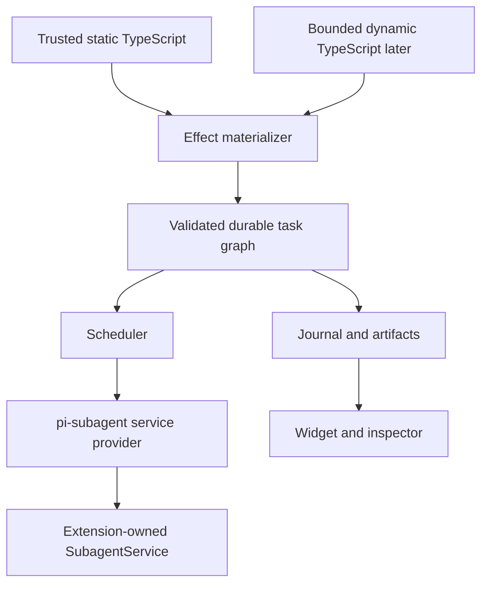

# Architecture

## Boundary

`pi-workflow` owns authoring interpretation, orchestration, and durable workflow
state. Physical agent execution belongs exclusively to `pi-subagent`.

Publication, push, pull requests, merge, release, and deployment are outside
this runtime.

## Layers

1. **Extension adapter** registers workflow tools, commands, lifecycle hooks,
   and UI projections.
2. **Registry** discovers definitions using Pi's effective agent directory and
   project trust.
3. **Authoring frontend** exposes typed task and artifact handles to trusted
   static TypeScript.
4. **Effect materializer** validates stable-keyed declarations and commits
   declarative task records.
5. **Scheduler** owns readiness, bounded concurrency, cancellation, budgets,
   and finalization.
6. **Executors** dispatch agent tasks through the shared service or run trusted
   deterministic support tasks.
7. **Store** owns events, snapshots, artifacts, leases, fencing, and replay
   records.
8. **UI** projects persisted state and never owns lifecycle authority.

## Definition roots

Name resolution is deterministic and provenance-aware:

1. `<cwd>/workflows/`
2. `<cwd>/.pi/workflows/`
3. `<getAgentDir()>/workflows/`
4. roots registered by trusted Pi packages
5. built-in workflows

Project roots require Pi project trust. Package roots register through a typed
workflow API; consumer paths are not hardcoded in the engine.

## Static workflows

Saved workflows are trusted TypeScript modules default-exporting one
`defineWorkflow` object. Input and output schemas are mandatory. The module
receives a bounded `WorkflowContext`; stores, scheduler internals, Pi extension
objects, credentials, and `SubagentService` are not exposed.

Effect calls return non-thenable task and artifact handles. The effect
materializer lowers each declaration into a validated `TaskSpec`. An explicit
`ctx.result` barrier waits for concrete data when orchestration control flow
requires it.

A workflow can therefore produce:

- a complete DAG when it declares handle dependencies before requesting values;
- an incrementally discovered DAG when later declarations depend on concrete
  earlier results.

The scheduler operates on the same declarative records in both cases.

## Durable execution

A run is durable from its first executable task. Before any child launch the
runtime has persisted:

- definition and input identity;
- workflow run creation;
- scheduler lease and fencing generation;
- materialized task declaration;
- task-execution generation;
- exact subagent preflight identity;
- launch intent and deterministic operation ID.

The initial scheduler is deliberately sequential. It derives readiness and
failed-dependency blocking from committed journal state, persists task readiness
before launch, and persists bounded terminal child evidence after `wait`. It
does not treat an in-memory wait promise as authority. Artifact import and child release are required later phases of the same
execution lifecycle, so child settlement alone cannot complete a task. The
workflow store imports schema-validated structured output as canonical JSON,
binds its provenance into artifact identity, persists import evidence, and then
persists release intent before invoking the owner client. Only a durable release
receipt permits terminal execution and task evidence.

Resume reconstructs state from the append-only journal and re-executes the
workflow function from its entry point. Matching task, result, phase, and log
effects replay or reconcile. Concrete result effects are loaded only from
schema- and digest-verified workflow-owned artifacts. The final return value is
validated and committed as a separate workflow output artifact before run
completion. JavaScript continuations are never serialized.

## Subagent integration

The `pi-subagent` extension registers one lazy provider on Pi's process-local
event bus. `pi-workflow` acquires that provider through
`@vegardx/pi-subagent/service-provider`, validates the exact runtime contract,
and obtains the same service instance used by the standalone subagent tool.

Workflow never:

- constructs a second `SubagentService`;
- starts Gondolin or a Pi child session directly;
- accesses subagent stores behind the service;
- shuts down the provider or service;
- treats a run ID as bearer authorization.

Each workflow run obtains an owner-bound client. The workflow adapter reacquires
the provider before each owner binding, pins the first service object for the
lifetime of that extension runtime, and rejects provider removal or service
replacement. It returns only the owner client, never the service or its shutdown
method. Missing, duplicate, malformed, or incompatible providers fail before
workflow work starts.

## Dynamic workflows

Dynamic workflows are a later authoring frontend over the same materializer.
Their code runs in a bounded worker-thread VM and calls host operations through
RPC. The host validates every requested task before committing it to the graph.

Dynamic code receives no direct filesystem, environment, process, credential,
network, module, store, extension, scheduler, or subagent object. The VM is a
determinism and API boundary, not an OS security boundary.

Recovery persists the approved source and digest, starts a fresh VM, re-executes
from entry, and replays matching effects through the same interpreter used for
static workflows.
